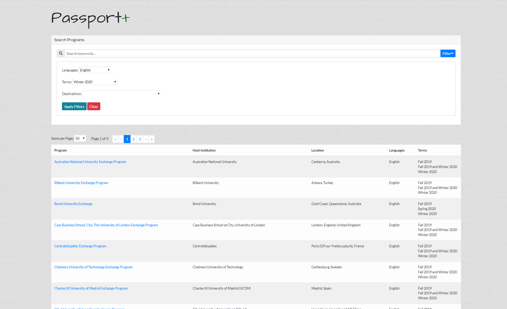

# passport-plus
Passport+ presents a minialistic and user-friendy interface, for filtering through exchange programs, using data scraped from Waterloo Passport. Built with Vue and Flask, using BeautifulSoup for scraping. 

